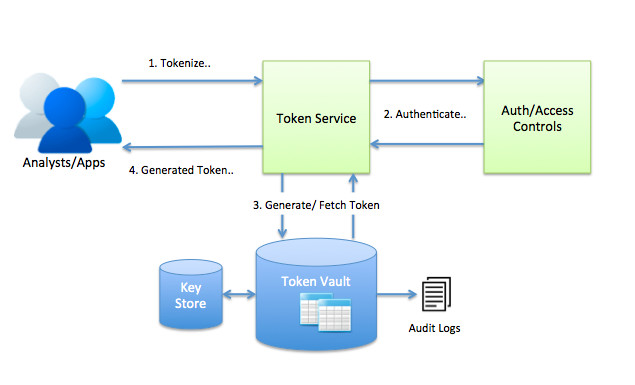

# Distributed Tokenization

Companies in finance, healthcare, insurance etc. deal with customer's sensitive data sets like PCI (Payment card industry), PHI (Protected health information), PII (Personally identifying information). They also need to comply with regulations like PCI-DSS, HIPAA etc. Most of the time sensitive data flows between various systems like payment, customer care, collection, risk and even analytics. Because of compliance companies need to encrypt sensitive data in all these systems and implement rigid authentication, audit and access controls. When regulators conduct audit they need to verify all the systems making the process very costly.

Not every system need to hold sensitive data even in encrypted form. Companies can utilize tokenization and store only tokens instead of encrypted original sensitive data. Tokens have no value even when they are stolen. Implementing tokenization makes systems more secure and reduce cost.

Lets understand how InsightLake's tokenization solution helps companies secure simply and make their sensitive data storage cost effective.

## Tokenization Versus Encryption
In encryption we use a secret key to encrypt the original data. Keys are stored at a secure place. If a hacker got hold of the keys or somehow using brute force generates one then he can decrypt the data. Because of this possibility systems which holds PHI, PII, PCI data in encrypted form are subjected to strict compliance and audit.

However in tokenization data is replaced with another un-related token value, no mathematical algorithm is used. So if hacker gets the token value then he can't generate the original data back. Systems which hold only tokenized data are not subjected to strict compliance requirements and that reduces cost and risk. Tokenization makes the implementation easier and less expensive.

Both encryption and tokenization works together to build a layered security architecture, which is compliant with regulations.

InsightLake's tiered security architecture allows companies to comply with regulations like PCI and HIPAA cost effectively while achieving maximum security.

It is essential to reduce the flow of sensitive data between many systems and secure it both in transit and at rest. Tokenization makes sensitive data secure and cost effective to manage. Tokenized data has no value and systems, which only store tokenized data don't need can manage compliance without rigid security and audit requirements.

Token mappings are stored in secured encrypted data store, which comply with regulations. All access to mapping stores are tracked and audited.

InsightLake tokenization solution uses strong encryption and key management with effective and flexible tokenization.

InsightLake Tokenization solution allows companies to leverage scalable token generation and secure storage. It allows them to use variety of token formats or design their custom format to tokenize all data types. Generated tokens and mappings are stored in secure encrypted storage systems, which are PCI-DSS and HIPAA compliant.

## Token formats example

NUMERIC_SAME - Replace original value with random numeric with same length
NUMERIC_SAME_LAST_FOUR - Replace original value with random numeric with same length, keep last 4 digits same
NUMERIC_SAME_FIRST_FOUR - Replace original value with random numeric with same length, keep first 4 digits same
ASCII_SAME - Replace original value with random ascii string with same length
ASCII_SAME_LAST_FOUR - Replace original value with random ascii string with same length, keep last 4 digits same
ACII_SAME_FIRST_FOUR - Replace original value with random ascii string with same length, keep first 4 digits same
GUID - 32 Byte random string
Custom

## Tokenization Service
InsightLake tokenization service enables REST endpoints to invoke the service for tokenization and de-tokenization.

Endpoint needs to pass following parameters to tokenize the data.

Endpoint key - secure first time registration key to use the API
Token format - variety of formats to choose from
Category - PII, PHI, PCI - for compliance and audit logging
Data Value
Tokens are generated using secure mechanisms like completely random generation, one way non reversible hash and other custom proprietary way.

## Secure Token Vault
Tokenization service will generate the token based on the format supplied and keep the mapping in encrypted secured data vault. Keys of this data store and keys used to generate the tokens are stored in secured key management solution. These keys are not available to any user or application other than token service. Access to this token mapping data store is highly regulated using security policies, strong authentication and access controls. All interactions are captured in audit logs and monitored. Users can't download more than 1000 entries in a given period to comply with the regulations. Tokenization system comply with regulations like PCI-DSS, HIPAA etc and provides regular audit reports.

## Tokenization helps in Analytics
Systems which stores transactions, customer data for analytics don't need PII, PCI data sets other than joining information. Encryption poses a challenge because then for analytics secure keys need to be distributed, which increases risk for sensitive data leakage as well it degrades the performance. Tokenization makes the solution secure without any performance impact.

To learn more, check out [http://insightlake.com/dataexplorer.html](http://insightlake.com/dataexplorer.html)

Installation
------
* Download or clone the repository. 
* Run bin/insightlake command.
* Open browser with URL as http://localhost:8080/
* Change configuration in /conf folder to set different ports
* By default H2 database is used, you can change the database details in jdbc.properties file

License
------
InsightLake Data Explorer is a commercial product but distributed to be used freely. Please contact contact@insightlake.com for details.

Getting Help
----------

You can get help easily :
Community - Google Groups
Slack Channel
Twitter
Facebook
Email: contact@insightlake.com
